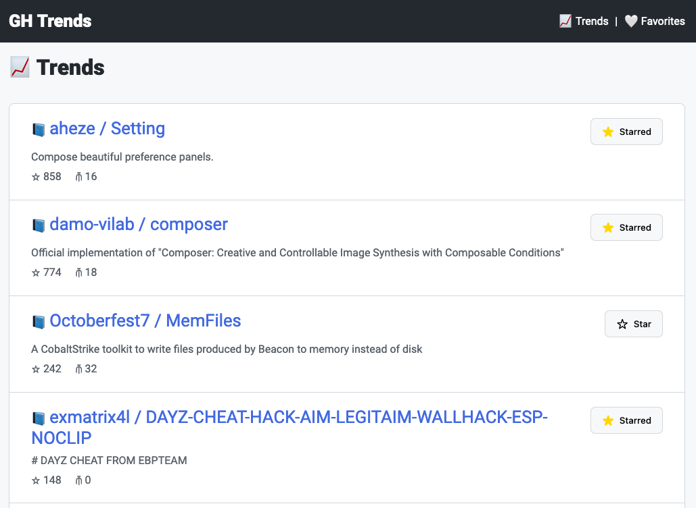
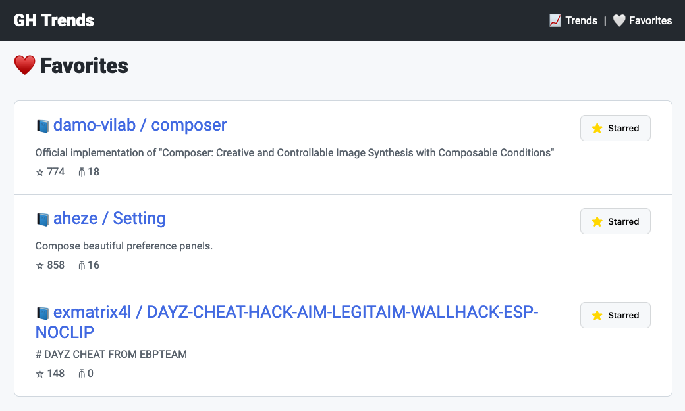
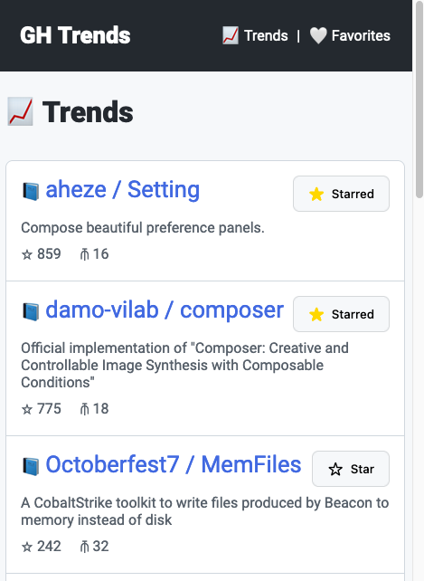
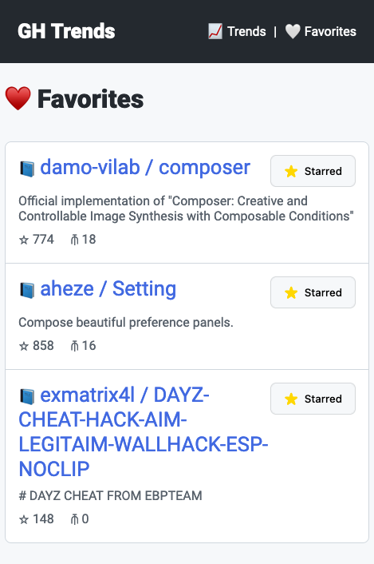

# GitHub Trends and Favorites

Using GitHub public API to list the most recent created repositories ordered by ⭐️ Stars count

**Live version**:  
https://cgomes-side-projects.github.io/github-trends/

**Screenshots 📸**

Desktop:

| Trends                               | Favorites                                  |
| ------------------------------------ | ------------------------------------------ |
|  |  |

Mobile:

| Trends                                      | Favorites                                         |
| ------------------------------------------- | ------------------------------------------------- |
|  |  |

## Running locally:

Requirements:

- NodeJS >= 18
- Yarn or Npm (I used yarn)

To run a local watch server:

```shell
yarn dev
```

To Build and export:

```shell
yarn lint
yarn build
yarn export
```

To test it:

```shell
yarn test
```

## Architectural decisions:

### NextJS

Next allows me to easy prototype without worry with dependencies and build / export commands

### react-query

React-Query is an excellent tool to fetch any time of data and keep the state.  
By using it, I won't have to manage the fetch lifecycle, like `isLoading`, `isError`, etc...  
I trust the authors to develop and test this features, giving me more time to focus on business
logic.

### Zustand as state manager

Zustand is easy to implement, and come with multiple tools out of the box.  
As storing the Favorites in localStorage was a requirement, I could use Zustand persistence to store
this data for me.  
This way I don't have to develop and test the store/retrieve data from localStorage myself.

### Emojis 😄 instead of an icons pack

For the sake of fast prototyping, I decided to use Emojis, if I had more time, I would go with
[font-awesome react](https://fontawesome.com/v5/docs/web/use-with/react), the svg version, as it
would better tree-shake the unused Icons.

### Sass over styled-components, or material-ui

I've decided to isolate the CSS from the components implementation,  
because I thought it would be easier to review it. And by not using a components library, like
material-ui, I could show better my CSS skills.

---

## Exercise 🏋️‍♀️

The idea of this project is to implement a small client application for discovering trending
repositories on GitHub.

- A list of the repositories created in the last 7 days with the most number of stars in github
  should be displayed and the user should be able to favourite them;
- The favourited repositories should be visible either through a filter or in a different tab. Some
  basic info about the repo should be displayed, such as: repo name, link to GitHub, description and
  number of stars.
- To keep things simple, the favourites won’t be sent back to GitHub’s servers but just stored
  locally (e.g localstorage, cookies etc...).

> 🍎 Bonus task: if time allows, the ability to filter the repos by the languages used would be an
> awesome addition to have.
